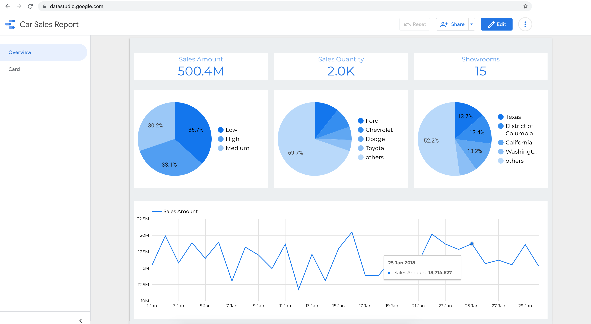

# GCP Infrastructure deployment to explore Big Data Analytics

Deploys various GCP resources using Terraform to get started with Big Data Analytics.

## Resources

- 1 Virtual Private Cloud Network
- 3 Private Subnets
- 3 Public Subnets
- 1 NAT Gateway
- 1 Firewall Rule (Access for Big Data Analytics tagged resources)
- 2 GCS Bucket (5 sample datasets- generated via https://www.mockaroo.com/)
- 1 BigQuery Dataset
- 5 BigQuery Tables
- 5 BigQuery Data Transfer Configs
- 1 Dataproc Cluster
- 1 Dataproc Workflow Template with 4 Dataproc Jobs

## BigQuery

### Update Sales Amount

```
UPDATE `ds_gcp_bda.sales` sales
SET amount = sales.quantity * product.price
FROM `ds_gcp_bda.product` product
WHERE sales.product_id = product.id;
```

### Create Denormalized Sales Fact View

```
CREATE VIEW `ds_gcp_bda.sales_fact` AS
SELECT
product.category car_categry, product.make car_make, product.model car_model, product.color car_color,
showroom.name showroon_name, showroom.staff_count showroom_emp_cnt, showroom.state showroom_state,
customer.gender customer_gender, customer.state customer_state,
sales.quantity sales_quantity, sales.amount sales_amount, sales.discount sales_discount, sales.card_type card_type, sales.txn_date sales_txn_date
FROM `ds_gcp_bda.sales` sales
INNER JOIN `ds_gcp_bda.product` product
ON sales.product_id = product.id
INNER JOIN `ds_gcp_bda.showroom` showroom
ON sales.showroom_id = showroom.id
INNER JOIN `ds_gcp_bda.customer` customer
ON sales.customer_id = customer.id;
```

### Sales Fact View Data Preview

```
select * from `ds_gcp_bda.sales_fact` limit 10;
```

### Visualize Data using DataStudio

Next you can use DataStudio, to create Data Source from the BigQuery View & generate a Report.
Ref: https://datastudio.google.com/



## Dataproc

Run the Workflow Template

Verify & analyze the data in Hive tables.

## Usage

- Clone this repository
- Generate & setup IAM user and download service account access credentials
- Generate a Key Pair in the region where you want to deploy the Resources
- Add the below Terraform variable values

### terraform.tfvars

```
project_id = "gcp-bda-project-111111"

ssh_public_key = "ssh-rsa AAAABBBB1234C..."
```

- Add the below variable values as Environment Variables

```
export GOOGLE_APPLICATION_CREDENTIALS="/Users/John/gcp-bda-project-111111-1a23456b7789.json"
```

- Change other variables in variables.tf file if needed
- terraform init
- terraform plan
- terraform apply -auto-approve
- Finally browse the GCP Console and explore the services.

### Destroy Resources

- terraform destroy -auto-approve
